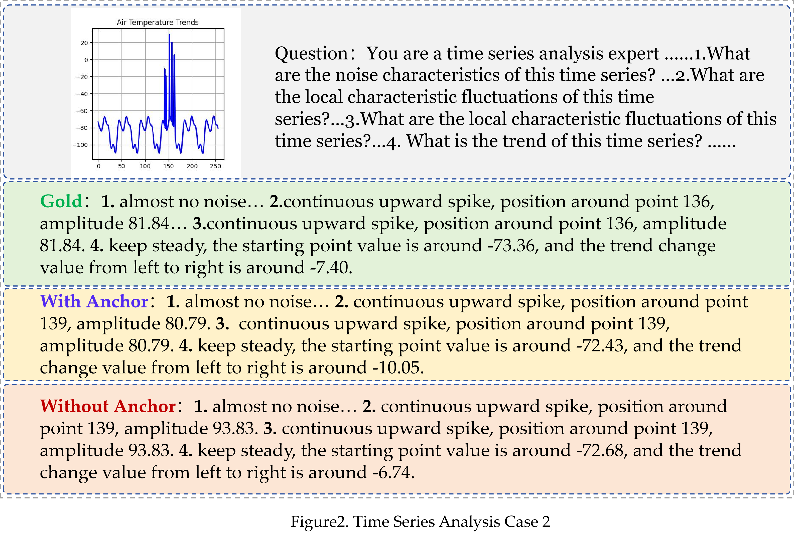
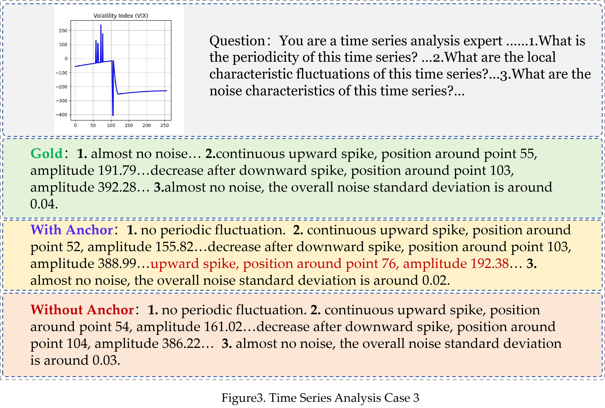

## **Reasoning prompts combined with GLR**

> You are given:
>
> - a full time series plot for global understanding
> - a local numeric window for precise analysis near the most question-relevant anchor point
>
> ### Anchor Point
> `$anchor_value_floor`
>
> ### Local Window Range
> `$left` to `$right`
>
> ### Local Window Data
> `$window_json`
>
> ### How to use the information
> - Use the full plot to understand the global trend and broader context.
> - For local fluctuation type, position, and amplitude near the anchor, rely more on the numeric window than on rough visual estimation.
>
> ### Full Plot
>
> [image]
>
> ### Question
>
> $question